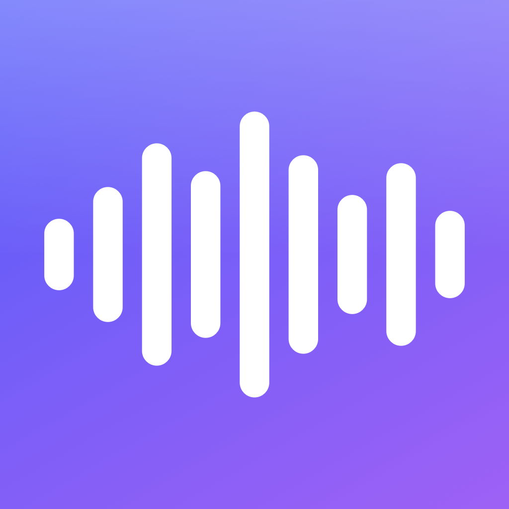

<p align="center"></p>

<h1 align="center">Margin</h1>

<p align="center">A free, local class notetaker for Mac and iPhone. It records your lectures, transcribes them on-device with Whisper, tells speakers apart, writes a LaTeX study sheet, and files each one into the right class folder.</p>

---

## What it does

- **Records anywhere with one shortcut.** Press <kbd>⌥⌘R</kbd> on the Mac (or use the Action button / Shortcuts on iPhone). A small Liquid Glass pill with a live waveform shows while you're recording.
- **Transcribes locally.** [WhisperKit](https://github.com/argmaxinc/argmax-oss-swift) runs Whisper on the Neural Engine. Nothing is uploaded and nothing gets pasted anywhere. Text appears about every 30 seconds while you talk.
- **Tells speakers apart.** Pyannote (SpeakerKit) labels who said what. Tap a name to rename "Speaker 1" to "Professor".
- **Files notes by class.** Add your classes once. Margin reads what was said and drops each recording into the matching folder: in the app, and as Markdown + PDF in `iCloud Drive/Margin/Classes/<Class>/`.
- **Writes a LaTeX note sheet after every lesson.** The sections are always the same: Overview, Reminders & Announcements (test dates, homework), Key Equations, Core Concepts, Definitions, Worked Examples and Review Questions. Small talk is left out. It's compiled to PDF with [Tectonic](https://tectonic-typesetting.github.io).
- **Ask questions about any class.** "What's on the test?", "Quiz me", "Explain the hardest part".
- **Uses your normal Claude plan, not the API.** The Mac app runs your own signed-in [Claude Code](https://claude.com/claude-code) (`claude auth login`) in the background, so sheets and answers count against your Pro/Max usage. API keys are stripped from its environment and tools are disabled. Without Claude, Margin falls back to Apple Intelligence or built-in offline summaries.
- **Imports voice memos.** Drag audio onto the Mac window, or on iPhone use Voice Memos → Share → Margin.
- **Exports everything.** PDF sheet, `.tex`, Markdown, transcript (`.txt` / `.srt`) and the original audio.
- **Syncs Mac ↔ iPhone through an iCloud Drive folder.** No paid developer account needed. The phone can record and transcribe on its own, and your Mac upgrades its notes with Claude when it's on.

Requirements: **macOS 26 (Tahoe) on Apple silicon**. For the phone app, **iOS 26**. About 1 GB of disk for the speech models.

## Set it up with Claude

Paste this into [Claude Code](https://claude.com/claude-code) on your Mac:

```text
Set up the Margin app for me from https://github.com/shahaklt/Margin.

1. Check that this Mac is on macOS 26 or newer with Apple silicon. If not, stop and tell me.
2. Make sure the Xcode Command Line Tools (xcode-select -p), Homebrew and git are installed.
   Install anything missing, and ask me before running any installer that needs my password.
3. Clone the repo into ~/Developer/Margin (if it's already there, git pull instead).
4. Pick a unique bundle ID prefix based on my macOS username, e.g. com.<username>.margin, and
   replace com.ltshahak.margin in Support/Info.plist and iOS/project.yml with it.
5. Install Tectonic for the LaTeX note sheets: brew install tectonic
6. Run ./build.sh. It builds Margin.app and installs it to ~/Applications. Fix any build errors.
7. Verify the pipeline headlessly: make a short two-voice test recording with `say`
   (different voices, saved as 16 kHz WAV), then run
   .build/release/Margin --selftest <file.wav> "AP Biology" "AP US History"
   The first run downloads the Whisper model (~630 MB). Show me the transcript it prints and
   confirm both speakers were detected.
8. Check whether Claude Code is signed in with my Claude subscription (claude auth status).
   If it isn't, tell me to run `claude auth login`. Margin uses that login, never an API key.
9. Open ~/Applications/Margin.app. Tell me to allow microphone access on the first recording,
   add my classes in the sidebar, and use ⌥⌘R to record.
10. Optional iPhone app: ask me if I want it. If yes, help me fork the repo, enable GitHub
    Actions on the fork, run the "Build iPhone IPA" workflow, download the Margin-ipa artifact,
    and walk me through installing it with Sideloadly (https://sideloadly.io) using my Apple ID.
    Then tell me to open Settings in the phone app and pick the iCloud Drive → Margin folder.

Don't change app behavior. When you're done, summarize what was installed and anything I
still need to do by hand.
```

## Manual setup

```sh
xcode-select --install          # if you don't have the Command Line Tools
brew install tectonic           # LaTeX engine for note sheets
git clone https://github.com/shahaklt/Margin ~/Developer/Margin
cd ~/Developer/Margin && ./build.sh
open ~/Applications/Margin.app
```

You don't need full Xcode for the Mac app. On first launch it downloads the Whisper and speaker models, and then Core ML optimizes them for your Neural Engine. That takes a few minutes, once. You can record in the meantime.

To use Claude for sheets and Q&A, sign in once with `claude auth login` (Claude subscription). Margin → Settings → Claude shows the account it's using.

## iPhone (Sideloadly, no Xcode needed)

The iPhone app is built by GitHub Actions on a cloud Mac that has Xcode:

1. Fork this repo, open the fork's **Actions** tab and enable workflows.
2. Run **Build iPhone IPA**, then download the `Margin-ipa` artifact (an unsigned `.ipa`). Prebuilt IPAs are also attached to [Releases](https://github.com/shahaklt/Margin/releases).
3. Open [Sideloadly](https://sideloadly.io), plug in your iPhone, drop in `Margin.ipa`, and sign in with your Apple ID.
4. On the phone, turn on **Settings → Privacy & Security → Developer Mode**, then trust your Apple ID under **General → VPN & Device Management**.
5. In Margin → ⚙︎ → **Choose iCloud Drive Folder**, pick the `Margin` folder your Mac created.

Free Apple IDs re-sign every 7 days. Sideloadly's auto-refresh handles that while your Mac is on the same Wi-Fi.

On the phone you can record (with a live waveform and transcript), import voice memos, transcribe on-device (Whisper Small) or hand the work to your Mac, read notes and sheets, export, and ask questions. Questions are answered on-device with Apple Intelligence, or by Claude on your Mac after syncing.

## How it's built

```
Sources/MarginKit/   shared by both apps: models, iCloud Drive sync, Whisper/SpeakerKit engine,
                     note generation, class matching, LaTeX sheet format, SwiftUI views
Sources/Margin/      Mac only: app entry, floating indicator, ⌥⌘R hotkey, Claude Code + Tectonic
iOS/                 iPhone app entry, phone layout, Shortcuts intent, XcodeGen project
.github/workflows/   unsigned IPA build + simulator screenshots + on-device pipeline test
```

- `./build.sh` builds the Mac app with SwiftPM. No Xcode project is needed.
- `iOS/check.sh` type-checks the iPhone app locally by compiling it for Mac Catalyst.
- `iOS/build-ipa.sh` builds the unsigned IPA. It needs Xcode, so CI runs it.
- `Margin --selftest file.wav "Class A" "Class B"` runs transcription → speakers → notes → filing headlessly. Set `MARGIN_SHEET_OUT=/path/sheet` to also write the LaTeX/PDF sheet with Claude.

## Privacy

Audio, transcripts and notes stay on your devices and in your own iCloud Drive. The only thing that leaves your Mac is the transcript text Margin sends to Claude, through your own Claude Code login, when you've signed in. Turn that off in Settings → Claude.
